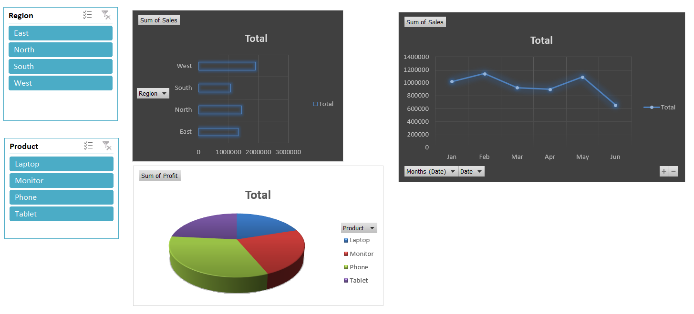

# 📊 Excel Interactive Dashboard – Sales Data Analysis

This repository contains an interactive **Excel dashboard** built for analyzing **sales and profit data** across different **regions**, **products**, and **months**. It demonstrates how Excel can be used as a powerful tool for data visualization and filtering without the need for code.

---

## 🧾 Features:
- 🎛️ Dynamic Slicers for Region and Product
- 📊 Bar Chart showing Total Sales by Region
- 📈 Line Chart displaying Monthly Sales Trend
- 🧩 3D Pie Chart visualizing Profit by Product
- 🌙 Clean and professional dark-themed visuals

---

## 📂 Files Included:
- `Sales_Dashboard.xlsx` – Contains raw data, PivotTables, and the interactive dashboard
- `dashboard_preview.png` – Screenshot of the final dashboard layout

---

## 📌 Usage:
1. Download the Excel file.
2. Open it in **Microsoft Excel (Desktop version)**.
3. Use the slicers to interactively filter data by **Region** or **Product**.
4. View how the charts automatically update to reflect your selections.

> ⚠️ Note: For full functionality (slicers, charts), open in **Excel Desktop**, not Google Sheets.

---

## 📷 Dashboard Preview:

---

## 🔖 Ideal For:
- Business Analysts
- Excel learners
- Portfolio/demo projects
- Sales reporting
